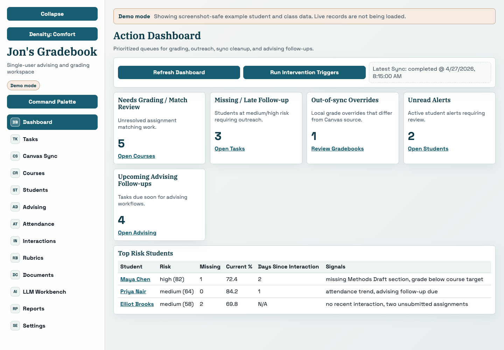
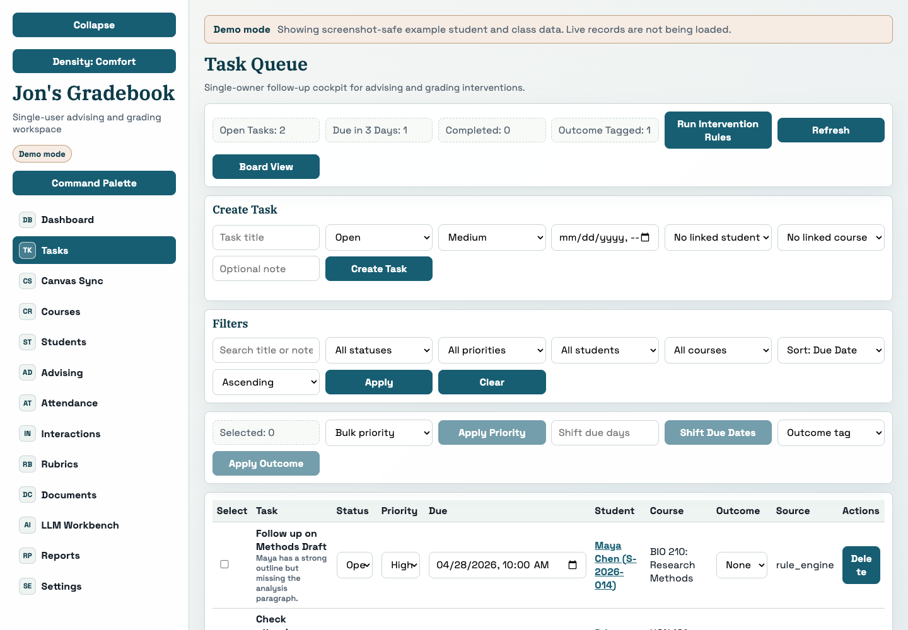
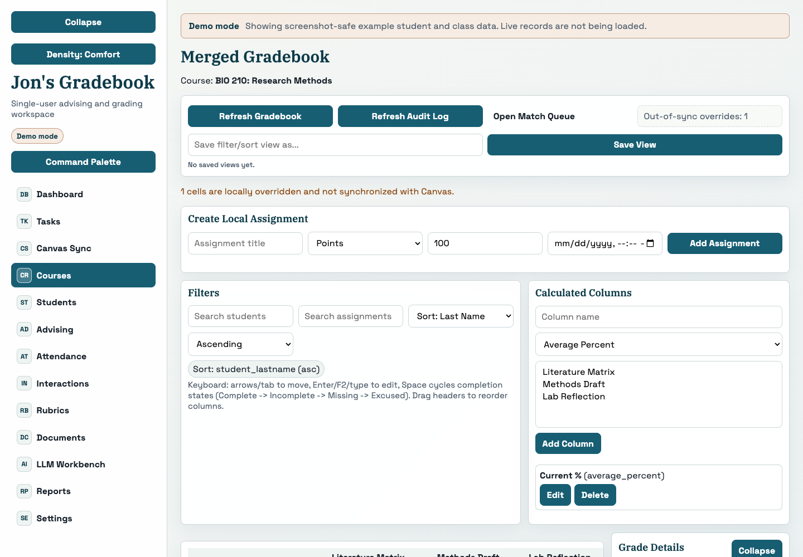
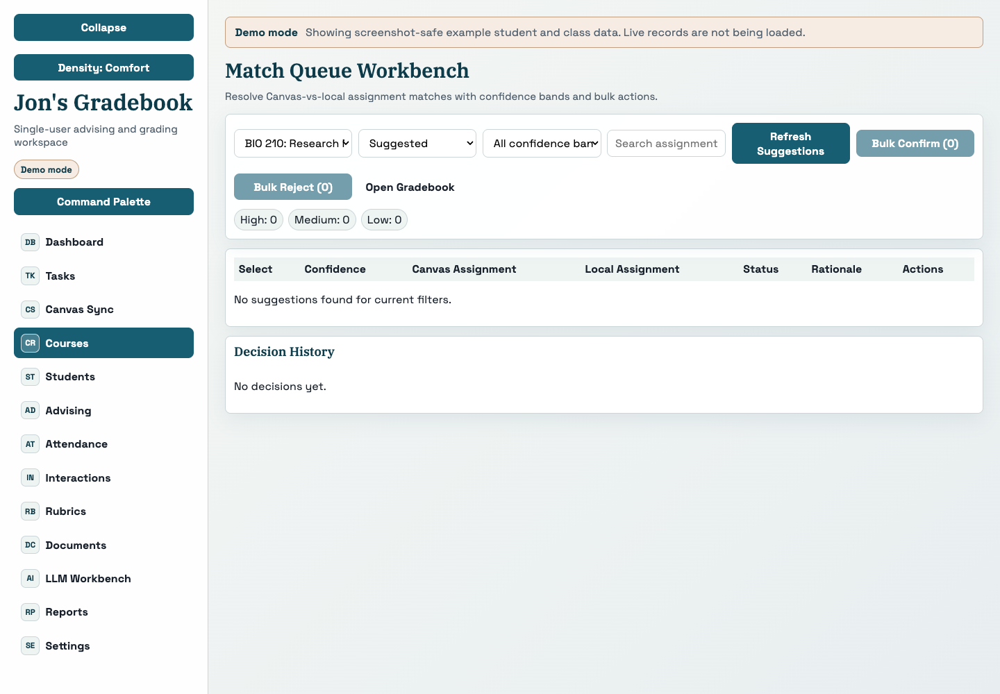
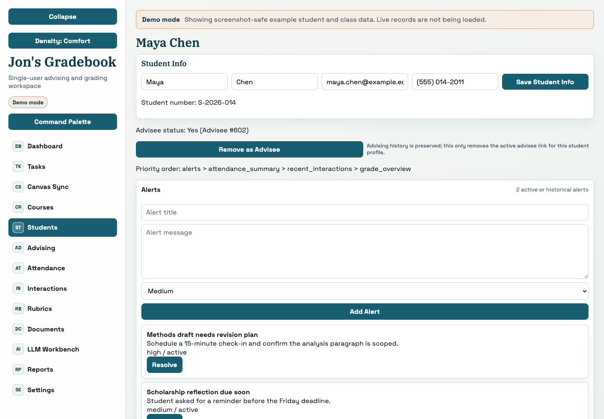
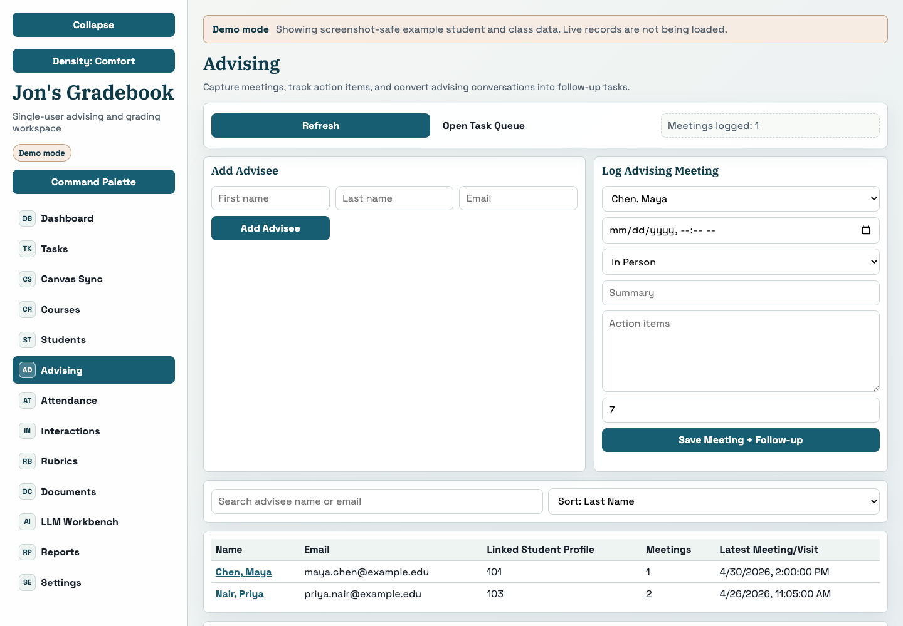
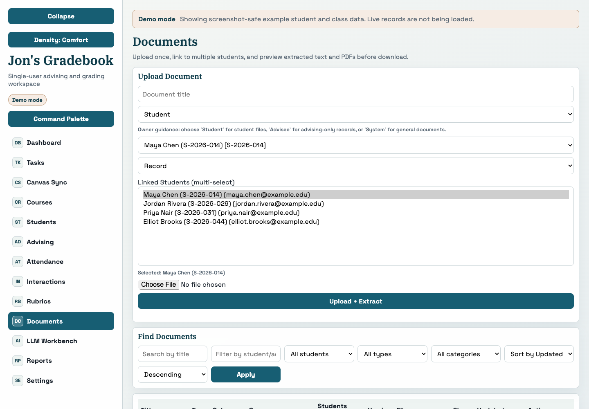
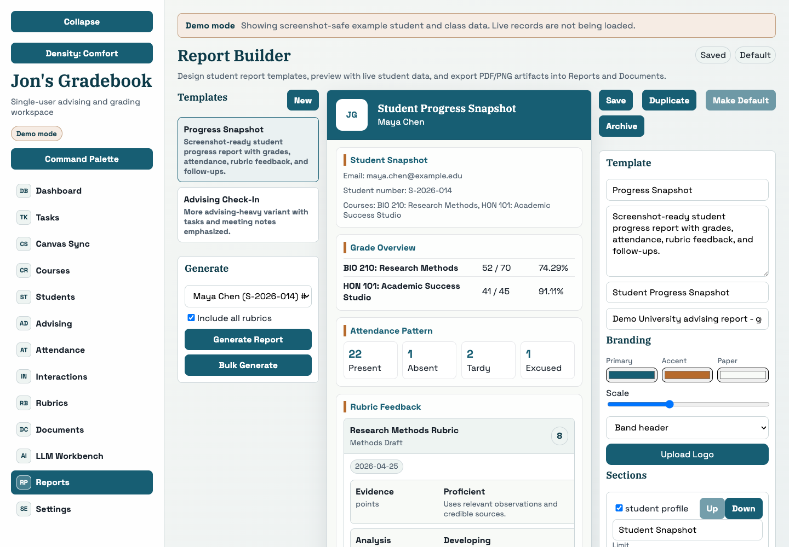
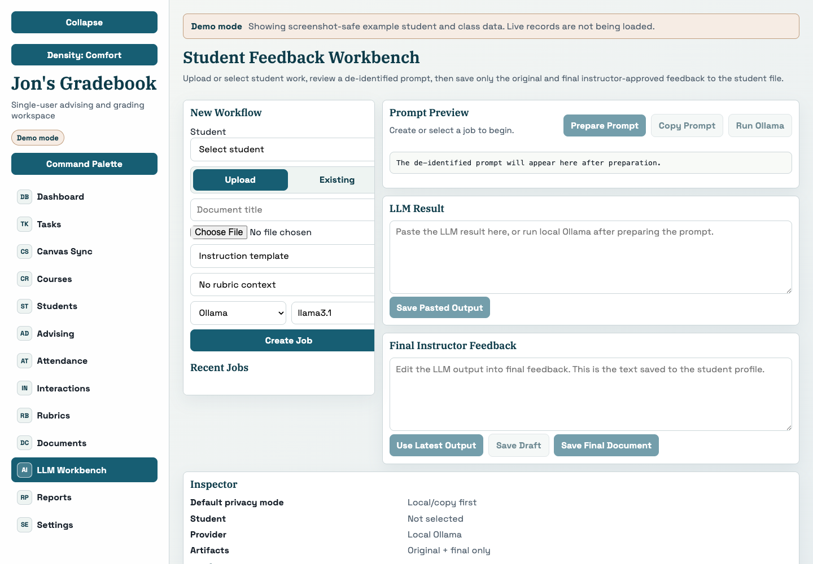
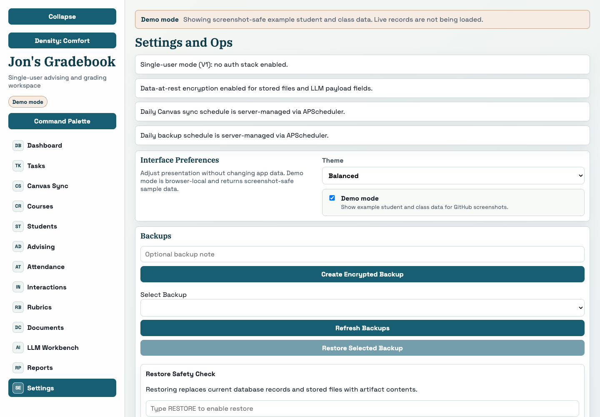

# Screenshot Gallery

This gallery uses browser-local demo mode, so every image contains screenshot-safe example students, courses, tasks, documents, reports, and feedback data. The screenshots are sized for README previews and social posts.

To refresh the gallery, start the frontend and run:

```bash
cd frontend
npm run dev -- --host 127.0.0.1
npm run screenshots:demo
```

## Suggested Social Post Copy

Jon's Gradebook is a local academic operations cockpit for instructors who want one place to triage student risk, review gradebook work, manage advising follow-ups, organize documents, build reports, and prepare privacy-first LLM feedback.

Demo mode keeps the tour screenshot-safe: it swaps live records for example students and clearly labels every screen.

## Core Workflow Tour

### Action Dashboard

Triage grading, late work, sync issues, top-risk students, and advising follow-ups from one starting point.



### Task Queue

Track intervention tasks with priority, status, due dates, and student/course links.



### Course Gradebook

Review Canvas-imported assignments beside local edits, calculated columns, saved views, and audit-aware grading controls.



### Match Queue Workbench

Review Canvas-to-local assignment match suggestions, confidence bands, bulk actions, and decision history before merging records.



### Student Profile

Bring grades, attendance, documents, interactions, advising meetings, rubrics, reports, and local student details into one profile.



### Advising

Capture advising meetings, action items, follow-up timing, and conversions into tasks.



### Documents

Upload once, link a document to multiple students, filter by person, and preview extracted text before download.



### Report Builder

Design student report templates, preview live sections, and generate PDF/PNG artifacts back into Reports and Documents.



### LLM Workbench

Prepare de-identified prompts, keep raw LLM work separate, and save only instructor-approved final feedback as student documents.



### Demo Mode And Operations

Toggle screenshot-safe demo data, choose an interface theme, manage settings catalogs, and keep backup/restore controls close by.


